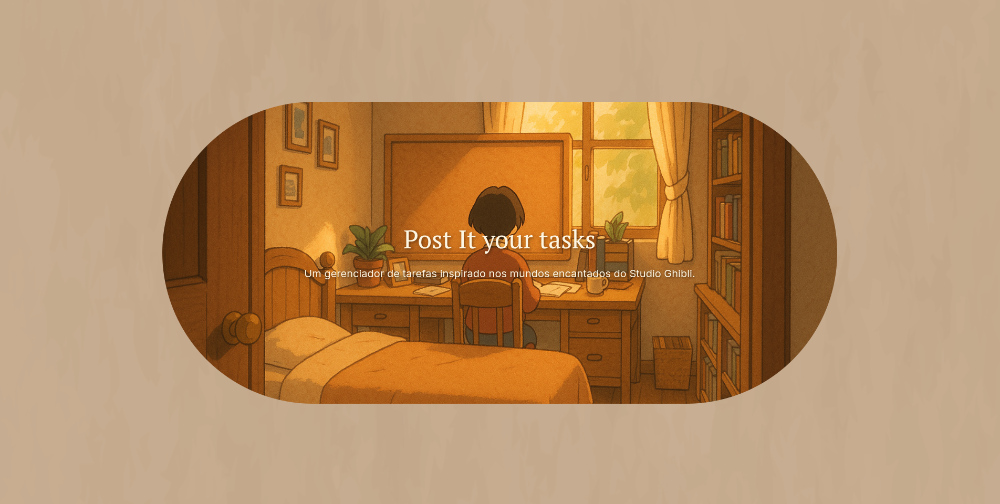
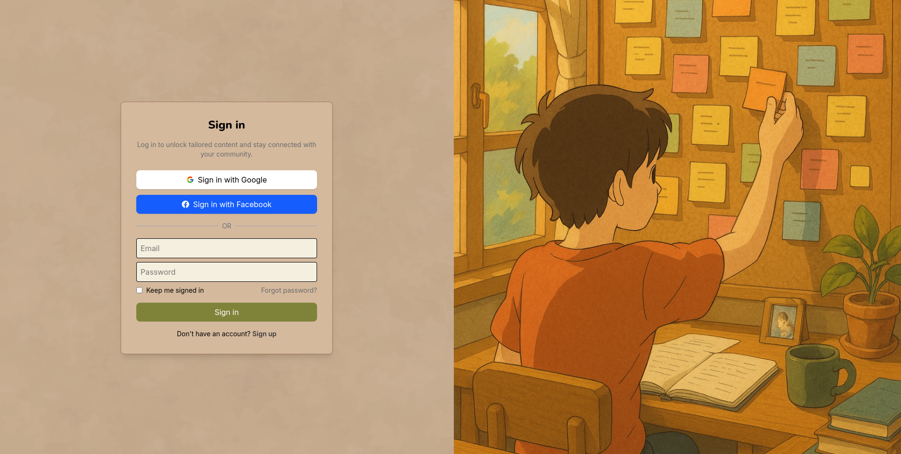
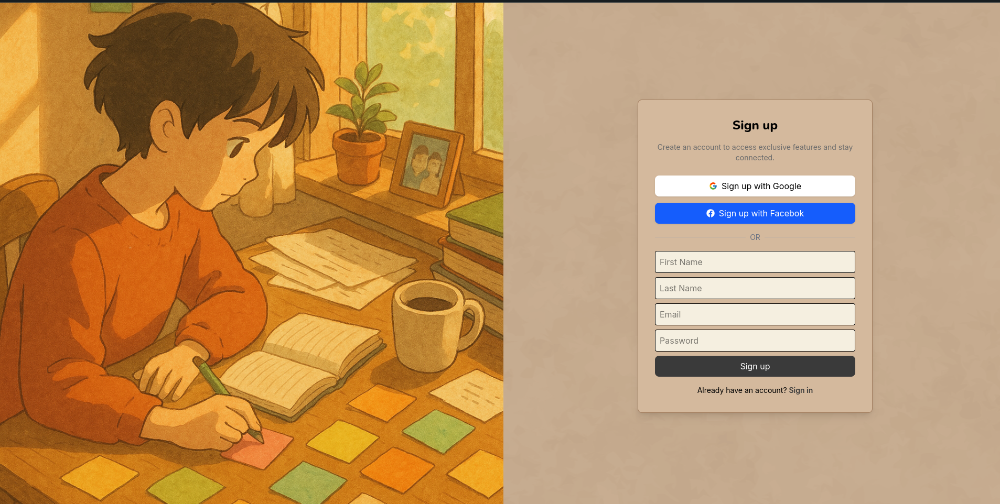
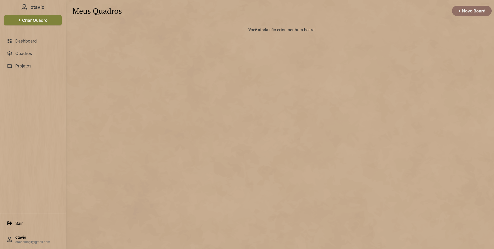
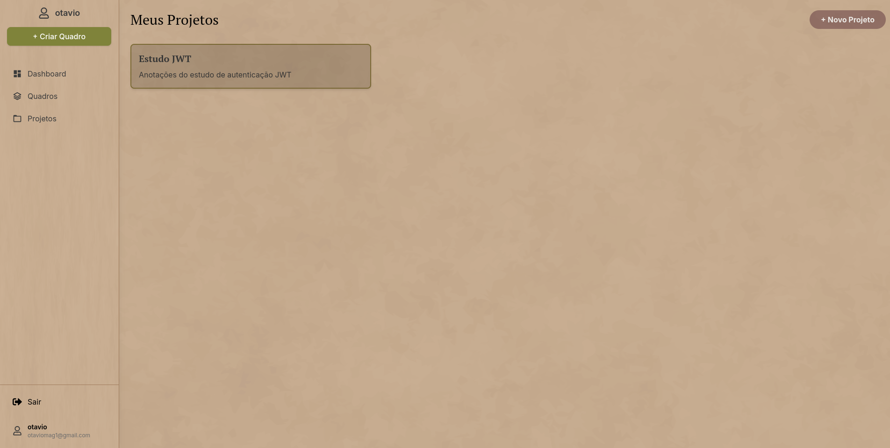
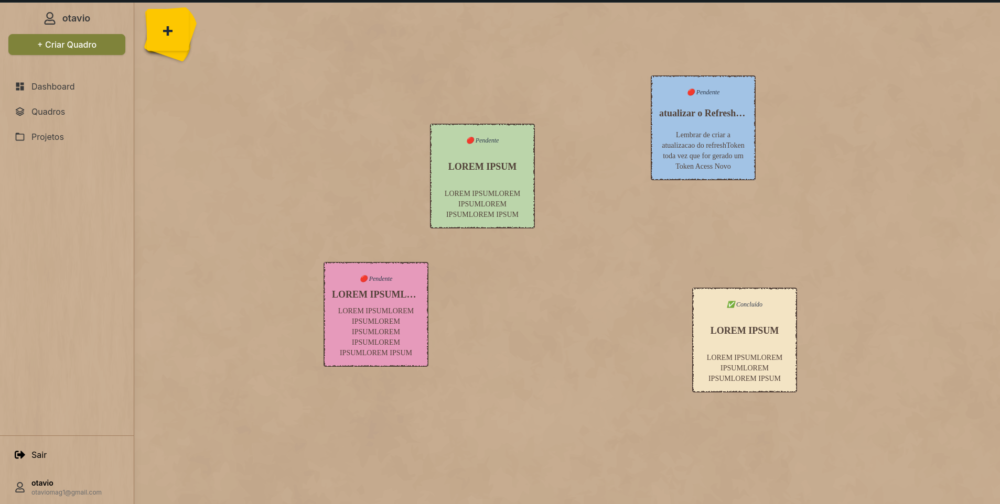
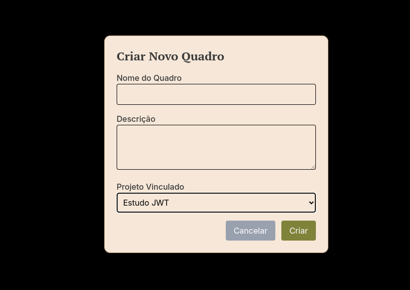
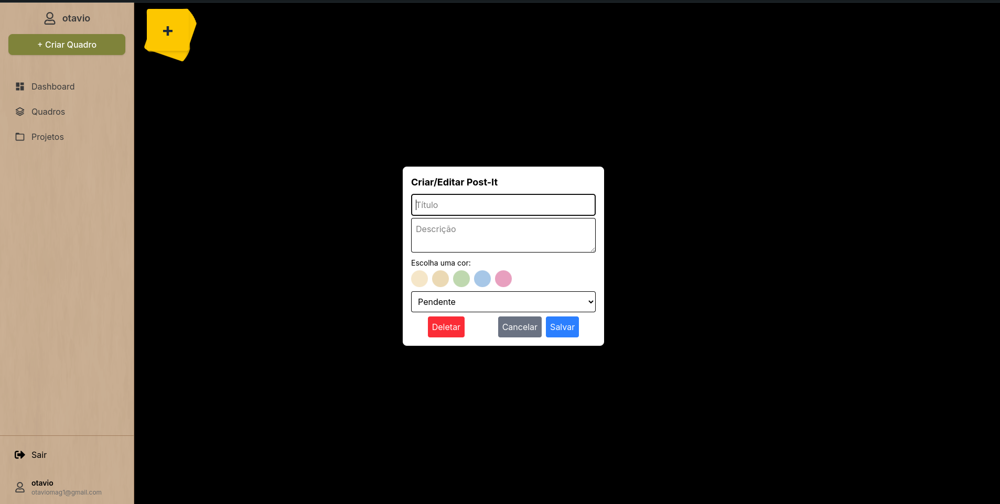

# 📌 Post-it Manager

Este projeto foi desenvolvido com foco em aprendizado.

🎯 Trata-se de um sistema completo de gerenciamento de tarefas, inspirado no conceito visual de post-its, com funcionalidades robustas voltadas à organização, produtividade e colaboração em equipe.

✨ O design visual do sistema foi inspirado na estética encantadora dos filmes do Studio Ghibli, trazendo uma interface leve, criativa e agradável de usar.



## 🚀 Funcionalidades

### 🎨 Frontend (React + Tailwind CSS)
- Tela de login e cadastro
- Página inicial com estilo inspirado no Studio Ghibli
- Boards com:
  - Visualização de boards por projeto
  - Modal de criação/edição de post-its
  - Modal para criação de boards
  - Quadro de tarefas com post-its arrastáveis
  - Confirmação antes de deletar
  - Responsividade
-Projetos:
 - Visualização de projetos

### 🧠 Backend (Node.js + Express + MongoDB)
- Autenticação com Passport + Session + Cookies
- Proteção de rotas por middleware (`checkAuth`)
- Validação com express-validator
- Relacionamento entre usuário, projeto, board e tarefa
- Organização:
  - Um projeto pode ter vários boards
  - Um board pertence a um projeto
  - Um board pode ter várias tarefas
  - Cada tarefa pertence a um board
- Verificações de permissão e consistência
- Boas práticas com middlewares e schemas separados

---

## 🧪 Tecnologias utilizadas

- **Frontend**: React, Tailwind CSS, Framer Motion
- **Backend**: Node.js, Express.js, MongoDB, Mongoose
- **Auth**: Passport.js (estratégia local) - OAuth2.0 Google
- **Validação**: express-validator
- **Sessões**: express-session + connect-mongo

---

## 🖼 Prints do Projeto










---

## 🛠 Como rodar o projeto localmente

### Pré-requisitos

- Node.js
- MongoDB

### Clonando e iniciando

```
git clone https://github.com/seu-user/postit-manager.git
cd postit-manager
```

# 🔧 Backend

```
cd backend
npm install
npm run dev
```

# 💻 Frontend

```
cd frontend
npm install
npm run dev
```
